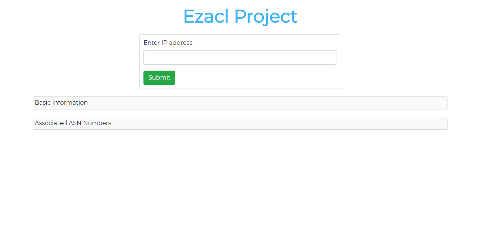
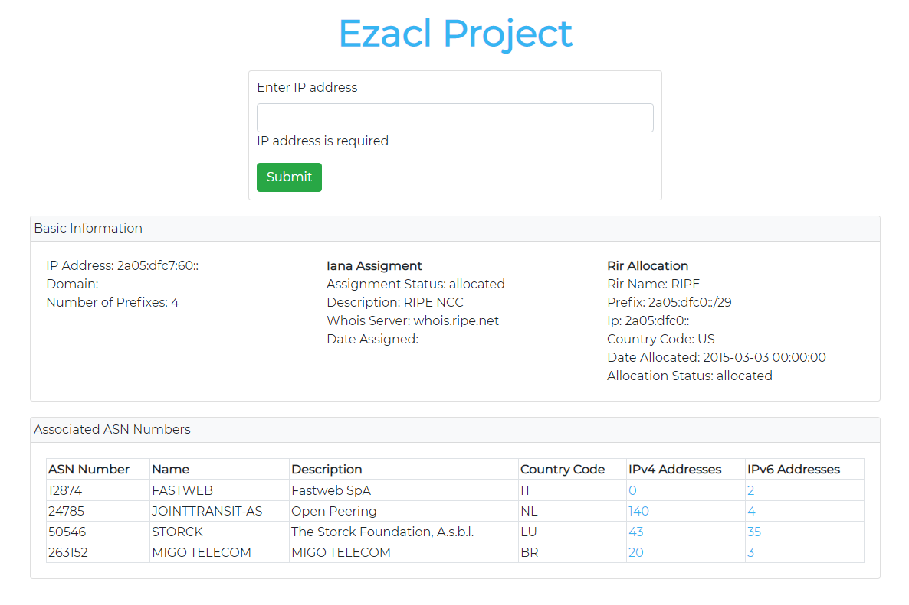
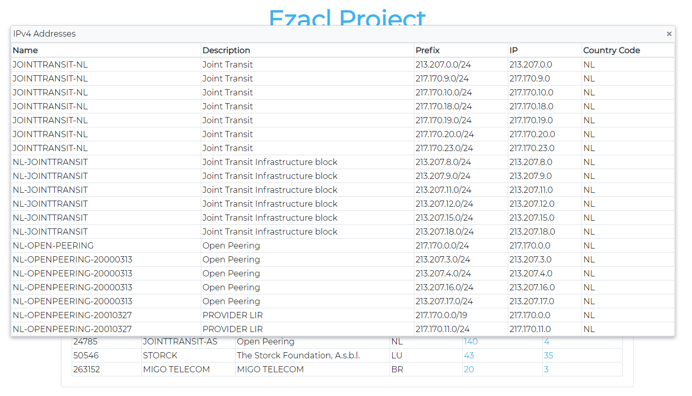
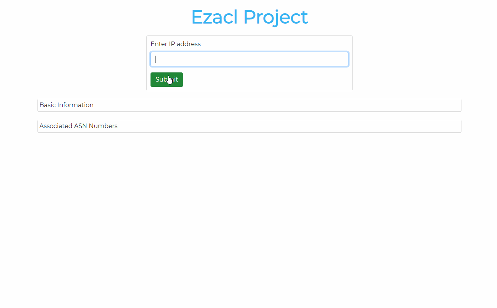

# Ezacl Project
Website that allows users to view analytics data on an IP address. This project was used with Python 3.7.9 and Angular 10.2.4.

## Overview

Users can enter an IP address

Basic information about the IP as well as Information about the ASN prefixes are displayed

The IP addresses of each ASN object can be viewed in more detail

Walkthrough gif

# Getting Started
## Installation - Backend
1. Navigate to `ezacl_project/backend`
2. Create a virtual environment:
    - `pip3 install virtualenv`
    - `python3 -m virtualenv venv`
    - `source venv/bin/activate`
3. Install all of the required python packages 
    - `pip3 install -r requirements.txt`

## Starting the Backend Server 
1. `python3 server.py`

## Installation - Frontend
1. Navigate to `ezacl_project/frontend`
2. `npm install`

## Starting the Angular Client App
1. `ng serve`
2. View the app at `localhost:4200`

## Tests
There are some basic test cases for the endpoint `/api/v1/user_input`. The tests can be run with `python3 test_server.py`

## References
- [Angular FastAPI](https://github.com/bubthegreat/cookiecutter-angular-fastapi)
- [IP Address Validator](http://jsfiddle.net/DanielD/8S4nq/)